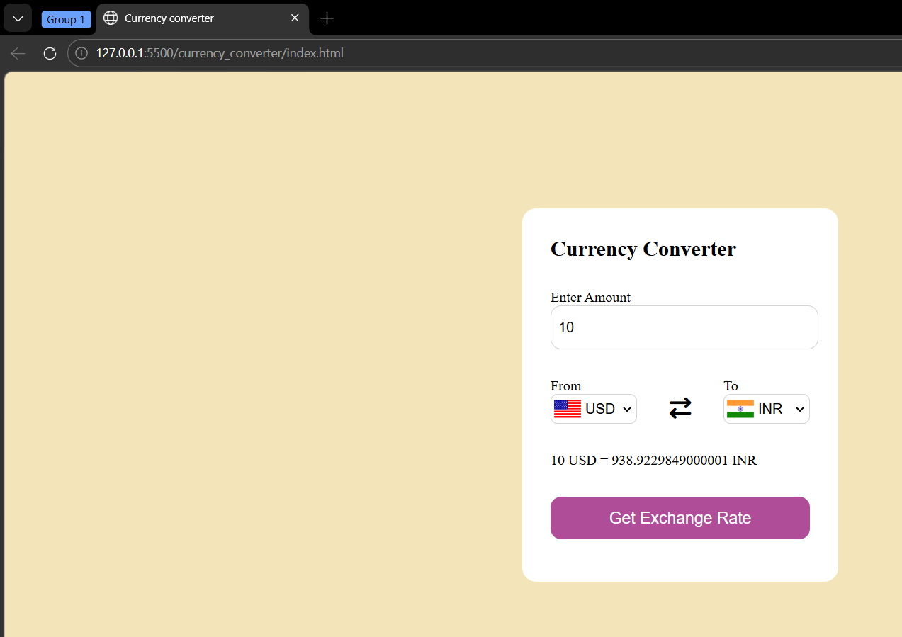

# Currency Converter

An interactive Currency Converter web application built using HTML, CSS, and JavaScript. This project demonstrates real-time data fetching using APIs, DOM manipulation, and dynamic UI updates.
 

## Features

* Convert currencies in real-time
* Supports multiple international currencies
* Live exchange rates using API
* Automatic flag update based on selected country
* Default conversion (USD → INR)
* Input validation (handles empty or invalid values)
* Clean and user-friendly interface

## Tech Stack

* **HTML5** – Structure
* **CSS3** – Styling and layout
* **JavaScript (ES6)** – Logic and API handling
* **Exchange Rate API** – Fetching real-time currency data

## How the App Works

* User enters an amount
* Selects:

  * **From currency**
  * **To currency**
* Clicks on **"Get Exchange Rate"**
* The app:

  * Fetches real-time data from API
  * Calculates converted value
  * Displays result instantly

Example:

10 USD = 938.92 INR

## API Used

This project uses a free currency API:

https://cdn.jsdelivr.net/npm/@fawazahmed0/currency-api@latest/v1/currencies/

## Project Structure

currency-converter/
│── index.html
│── style.css
│── app.js
│── codes.js
│── preview.png

## How to Run Locally

1. Clone the repository:

git clone https://github.com/Ramu6014/currency-converter.git

2. Open the project folder

3. Run `index.html` in your browser

## Preview

## Author

**Ramu6014**
